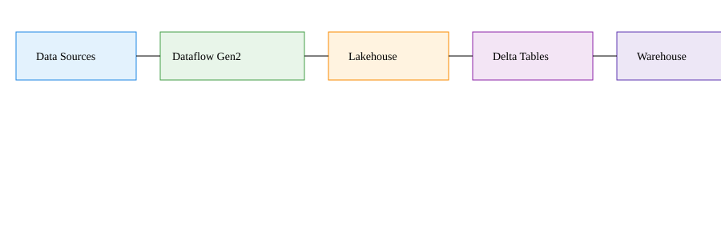
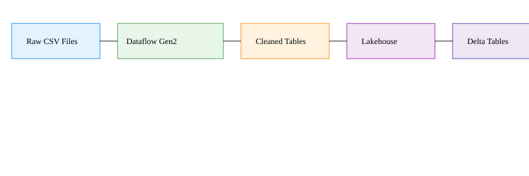
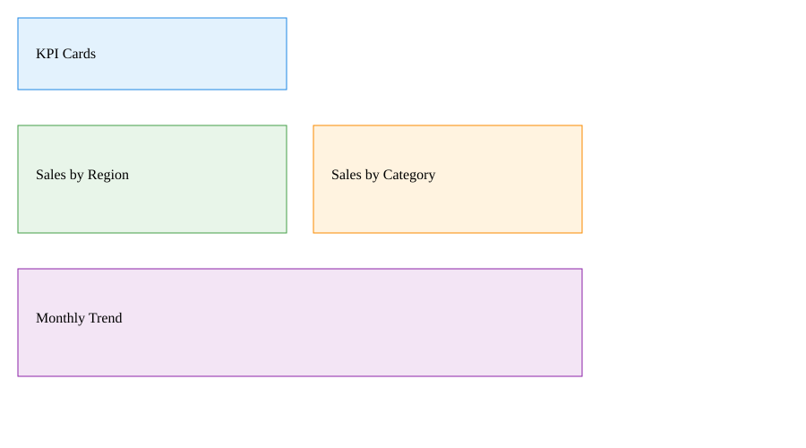

# 🚀 Sales ETL Pipeline Using Microsoft Fabric

<p align="left">

  <!-- Core Fabric Badges -->
  
  
  
  
  

  <!-- Tools & Output -->
  
  

  <!-- Status -->
  

</p>

<p align="left">

  <!-- GitHub Repo Stats -->
  
  
  

</p>

<!-- Banner -->
<p align="center">
  
</p>

## Overview
This project demonstrates how to ingest, transform, and load sales data using Microsoft Fabric Dataflow Gen2 and Power Query. The pipeline loads a CSV file, applies data type transformations, aggregates sales by product, and stores the final table in a Fabric Lakehouse.

## Diagrams

### Architecture


### Pipeline


### Report Preview


## Technologies Used
- Microsoft Fabric
- Dataflow Gen2
- Power Query
- Lakehouse (Delta Tables)
- Power Query M-code

## Transformation Steps

### 1. Load CSV into Power Query
Source file: `sample_sales.csv`  
Location: Lakehouse → Files

### 2. Promote Headers & Set Column Types
```m
Table.TransformColumnTypes(#"Promoted headers", {
    {"Product", type text},
    {"Category", type text},
    {"Sales", Int64.Type},
    {"Date", type date}
})


Table.Group(#"Changed column type", {"Product"}, {
    {"TotalSales", each List.Sum([Sales]), type nullable number}
})

### 4\. Resulting Summary Table

| Product | TotalSales |
| --- | --- |
| Laptops | 1220 |
| Mouse | 25  |
| Keyboard | 45  |
| Monitor | 300 |

## Author
**Sastry Malapaka**  
Old Bridge, New Jersey  
Microsoft Fabric Learner • Data Engineering Enthusiast
